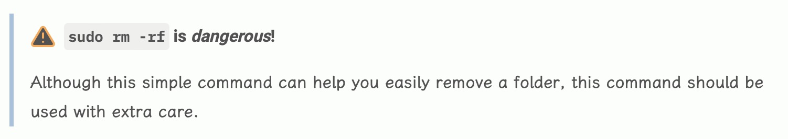
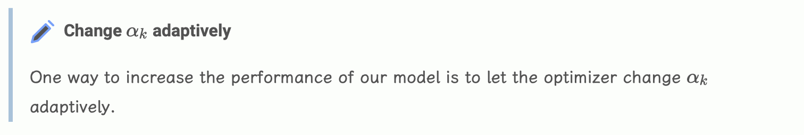
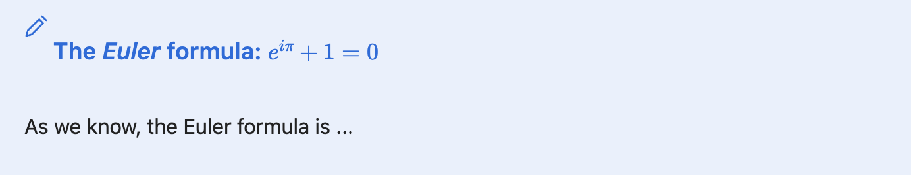

This is a remark plugin that adds [Obsidian](https://obsidian.md)-like [callout syntax](https://help.obsidian.md/Editing+and+formatting/Callouts).

Note that this is *not* a transformer plugin. Instead,
under the hood it adds syntax extensions to 
[`micromark`](https://github.com/micromark/micromark), 
which is the markdown parser used in 
[`remark`](https://github.com/remarkjs/remark/tree/main).

Issues and pull requests are welcomed!

# Features

- Support nested callouts.

- Support markdown formatted elements inside your callout titles, for example, *code*, *emphasis*, *heading*, *math*, etc.

# Usage

## Installation
You can install this package via npm or pnpm.
```bash
# install using npm
npm install remark-callout

# install using pnpm
pnpm install remark-callout
```

## API

```ts
import { unified } from 'unified';
import remarkParse from 'remark-parse';
import remarkRehype from 'remark-rehype';
import rehypeStringify from 'rehype-stringify';

import remarkCallout from 'remark-callout';

const file = unified()
  .use(remarkParse)
  .use(remarkCallout)
  .use(remarkRehype)
  .use(rehypeStringify)
  .processSync(md);
console.log(String(file));
```
## Render Result Examples

```markdown
> [!warning] `sudo rm -rf` is *dangerous*!
> Although this simple command can help you easily remove a folder, this command should be used with extra care.
```

The generated HTML:

```html
<blockquote class="callout warning">
  <div class="callout-title warning">
    <span class="callout-icon" style="color: #ff9100"><svg xmlns="http://www.w3.org/2000/svg" width="16" height="16" viewBox="0 0 24 24" fill="none" stroke="currentColor" stroke-width="2" stroke-linecap="round" stroke-linejoin="round" class="lucide-alert-triangle"><path d="M10.29 3.86 1.82 18a2 2 0 0 0 1.71 3h16.94a2 2 0 0 0 1.71-3L13.71 3.86a2 2 0 0 0-3.42 0z"></path><line x1="12" y1="9" x2="12" y2="13"></line><line x1="12" y1="17" x2="12.01" y2="17"></line></svg></span>
    <p>
      <code>sudo rm -rf</code> 
      is 
      <em>dangerous</em>
      !
    </p>
  </div>
  <div class="callout-content">
    <p>Although this simple command can help you easily remove a folder, this command should be used with extra care.</p>
  </div>
</blockquote>
```

After adding some CSS, it could be rendered as follows (you can use your own CSS rules to make it appear better to your taste):


Other elements can also be rendered with the help of other plugins, e.g. *math* with the help of 
[`remark-math`](https://www.npmjs.com/package/remark-math):

```markdown
> [!note] Change $\alpha_k$ adaptively
> One way to increase the performance of our model is to let the optimizer change $\alpha_k$ adaptively.
```

The render result:


## Usage in Astro

As this is a remark plugin, you can easily add this into your Astro project.
Just add this plugin into `astro.config.mjs` file, inside the `remarkPlugins` property.

# Why this one?

There are some existing remark plugins for Obsidian-like callouts, including
[`@portaljs/remark-callouts`](https://www.npmjs.com/package/@portaljs/remark-callouts),
[`remark-callouts`](https://www.npmjs.com/package/remark-callouts), and
[`remark-obsidian-callout`](https://www.npmjs.com/package/remark-obsidian-callout).
The behavior of these plugins is not satisfactory for me, though.
In fact, `@portaljs/remark-callouts`'s callouts only support plain text callout title
(to my knowledge, `remark-callouts` is the same but deprecated version of `@portaljs/remark-callouts`),
such as
```markdown
> [!note] This is a plain text title.
> blablabla...
```
And `remark-obsidian-callout` will transform formatted text into plain text that is in the callout title.

But inside Obsidian, callouts' titles are parsed as formatted elements,
and as a result it supports including *heading*, *code segments*, *math*, etc.
in the callout title:
```markdown
> [!note] ##### The *Euler* formula: $e^{i \pi} + 1 = 0$
> As we know, the Euler formula is ...
```
In Obsidian, he above markdown segment will be rendered as

which makes callouts more powerful and useful.

The plugins `@portaljs/remark-callouts` and `remark-obsidian-callouts` are actually 
[transformers](https://github.com/unifiedjs/unified#function-transformertree-file-next). 
In comparison, this plugin provides *syntax*, *html*, and *mdast util* extensions to let remark support callouts.

This plugin, in contrast, supports formatted elements inside a callout title.

# To do list

- [ ] Maybe Collapsible callouts?

# License

MIT license.
